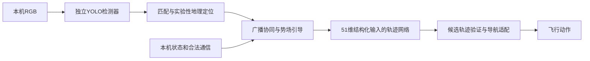

# 为什么出现mAP50：当前实现与端到端YOPO的区别

当前不是图像到轨迹的端到端网络。我们只实现了YOPO引导学习的轨迹代价反传和分数头训练，视觉支路另用了YOLO检测器。mAP50属于该检测支路，不能作为YOPO规划学习或比赛成绩的主指标。

## 当前已实现的模块化基线

`learning/guidance.py`中可微轨迹代价J更新轨迹网络，分数头拟合负代价；`vision.cmd train`独立更新车辆检测器。两套训练图没有连接，轨迹损失不会传到视觉编码器。在线把模块串起来不等于端到端训练。

YOPO原方法使用深度观测和状态直接预测候选轨迹与分数，以环境/轨迹代价的梯度指导训练，不需要把车辆框检测精度作为主目标。本地原项目对照入口为`YOPO/YOPO/policy/yopo_trainer.py`及`loss/`，本工程没有改动它们。

## 若以视觉端到端为主线，需要的改变

这部分是架构说明，尚未实现，不能标成已完成。

1. 本机RGB序列、状态、合法通信进入共享视觉/时序编码器，直接输出固定翼可执行的多候选轨迹及分数。原YOPO深度图输入不能直接当成比赛RGB。
2. 将可微固定翼轨迹展开、边界/间距/平滑/任务代价接到该网络，验证轨迹代价的梯度确实到达视觉编码器。仅训练结构化输入MLP不满足这一点。
3. 比赛另有真假识别与双机观察任务，可设身份、可见性等辅助头。端到端可以有辅助监督，但不能用mAP上涨替代规划任务学习。
4. 按未见场景验证，检查遮挡、图像替换等情况下轨迹是否合理改变，避免网络只用状态而忽略图像。现有64张相似布景裁剪不足以训练/验证这一方案。
5. 保留SDK输入/动作/通信约束和必要的动作检查；是否有安全检查不是判断端到端训练的依据，关键是图像到轨迹是否共享计算图和任务梯度。

## 应该看哪些指标

| 层级 | 指标 | 不能替代什么 |
| --- | --- | --- |
| 独立检测支路 | mAP、真假分类错误率、漏检 | 规划学习、双机任务成绩 |
| 引导规划训练 | 轨迹代价、评分选择误差、可行率 | 真实动力学和比赛得分 |
| 视觉端到端验证 | 视觉梯度、图像依赖、未见场景闭环表现 | 正式任务验收 |
| 比赛 | K=2持续20秒、清除率、报告误差、诱饵误识、违规、600秒官方分数 | 不能由训练损失或mAP推算 |

目前模块化基线用于验证比赛输入、执行接口和日志证据，不能把它描述成已经完成端到端YOPO。训练/推理命令见`../VISION_TRAINING_AND_INFERENCE.md`，实际进度见`VISUAL_CLOSED_LOOP.md`。
